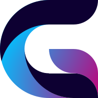

# Graphics design final project

## Logo

Logo's main idea that's it a first capital letter of my last name Goberis.

Ideas for logo I've got by searching for single letter G projects on dribbble.com; Most of results were brand logos. Main trend for design was final shapes were build from parts of simple regular shapes, proportions follow some kind of rule (are orderly), frequent gradient, sature color pallet.

Thereof, I chose similar rules for my own design:
- G needs to be constructed from simple shapes(circles, rectangles, triangles)
- G needs to have some simplier proportions among it's parts and shapes(definetly not freedrawn)
- G idealy uses gradient as part of it's fill