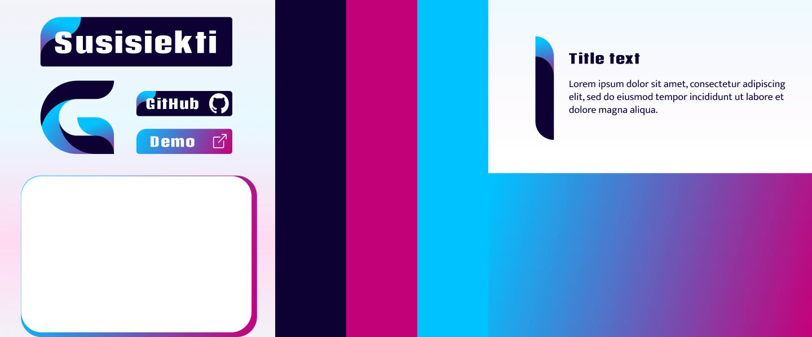
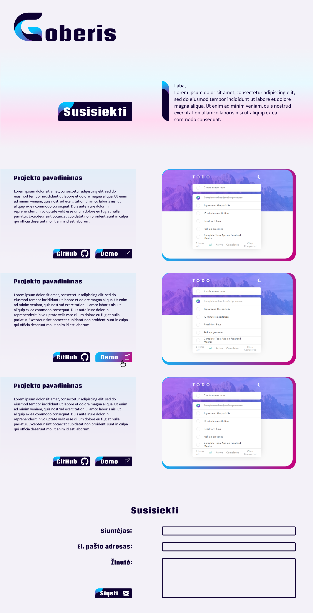

# Graphics design final project


## Goal

Goberis.lt is a personal portfolio website of Web Developement works. The main aim of the website is to showcase my projects I was involved with to help get sence of my Front-end Development and general programming skills.

The website is aimed at prospect employers or personal friends and family.

## Moodboard



## Design choice

Website is ```clean``` and ```light```. Design itself shouldn't draw too much attention but concentrate it on the links to the projects.
Light background makes site look morer profesional

Color pallet is composed of ```Navy blue``` and ```gradient of Violet-Cyan```. Navy blue is main color for text, buttons and borders. Violet-Cyan is used as accent or CTO. 

Buttons are comparativly ```large``` in size. All borders are rounded my 5px except ```top-left 36px```. Filler collor is Navy blue, with gradient 'leaf' to the left as embelishment . While hovering, fill changes to Violet-Cyan gradient.

Content is split in two columns.

First view of the site is header containing Logo, ```introduction``` and shortcut to cantact area.

Following, articles of Projects. Left side of the ```project``` contains description and links to the Demo and Github pages. Right side shows project's snapshot.

At the bottom, email ```contact``` form and other channels of communication.


## Technologies used for final website

 For design - main software used was ```Figma``` for logo and wireframe reprezentation. ```Chrome color picker``` extension for quickly getring color codes form online pictures. Dribbble.com; onepagelove.com was the main source of inspiration. 

 For website building - main framework is ```React```. No CSS libraries or precompilers were used. In addition to React, ``NPM and command console`` were used.

 ```VScode``` and it's packages like ```ESlint``` for writing source code.
## Logo

|||
|:---|:---:|
| Logo's main idea that's it a first capital letter of my last name Goberis. |  | 

Ideas for logo I've got by searching for single letter G projects on dribbble.com; Most of results were brand logos. Main trend for design was final shapes were build from parts of simple regular shapes, proportions follow some kind of rule (are orderly), frequent gradient, sature color pallet.

Thereof, I chose similar rules for my own design:
- G needs to be constructed from ```simple shapes``` (circles, rectangles, triangles)
- G needs to have some simplier ```proportions``` among it's parts and shapes(definetly not freedrawn)
- G idealy uses ```gradient``` as part of it's fill

Reasoning for rules are oriented toword achieving ```pleasant aesthetics```. Design itself should be clean and give focus to content. Simple shapes are usual for users and therefor, not visualy burdensome, clean, comprehendible. Proportions gives ease when Logo needs to be halved, flipped or otherwise manipulated becouse dimentions could be easily calculated. One personal goal of the project was to use gradient in overal design, including Logo.

Logo can be easily divided into 16 squares and within each square, stroke happens to be simple arch.


## Website plan

Structure of the website is simple. Goal is to give access of needed project or contacts to the user as fast as possible. Script of using website is linear, with minimal alternative routes. At the top, website's name and a link to the bottom of the page where contacs are. Up next, brief introduction and idea of the site. Next, articles of projects following one another. Links to the project opens in another tab. At the end of the articles is a contact form and other contact alternatives, link to the top of the page.  
~~~
↱ Website name
|       ↓
| Brief introduction
|       ↓
| Articled of the projects   ⇄   Project
|       ↓
↳ Contacts
~~~

## Wireframe

